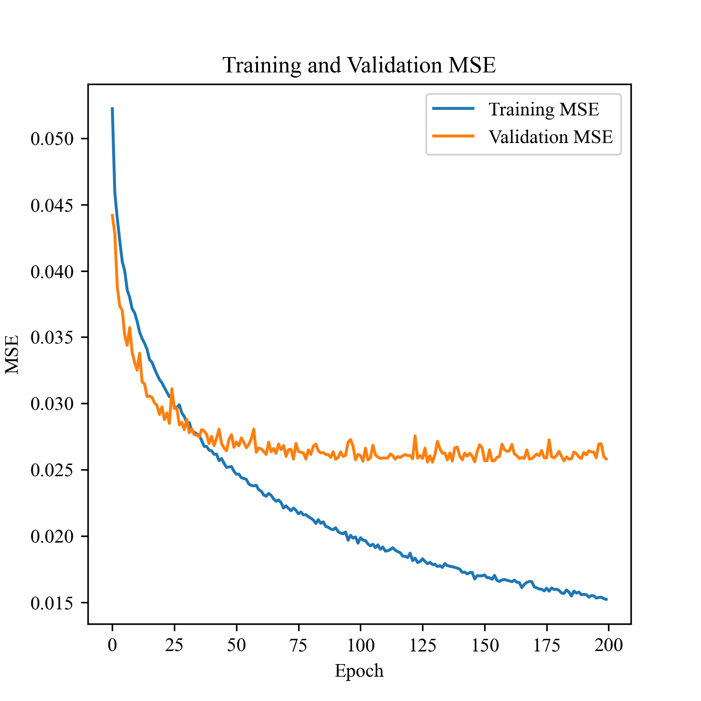
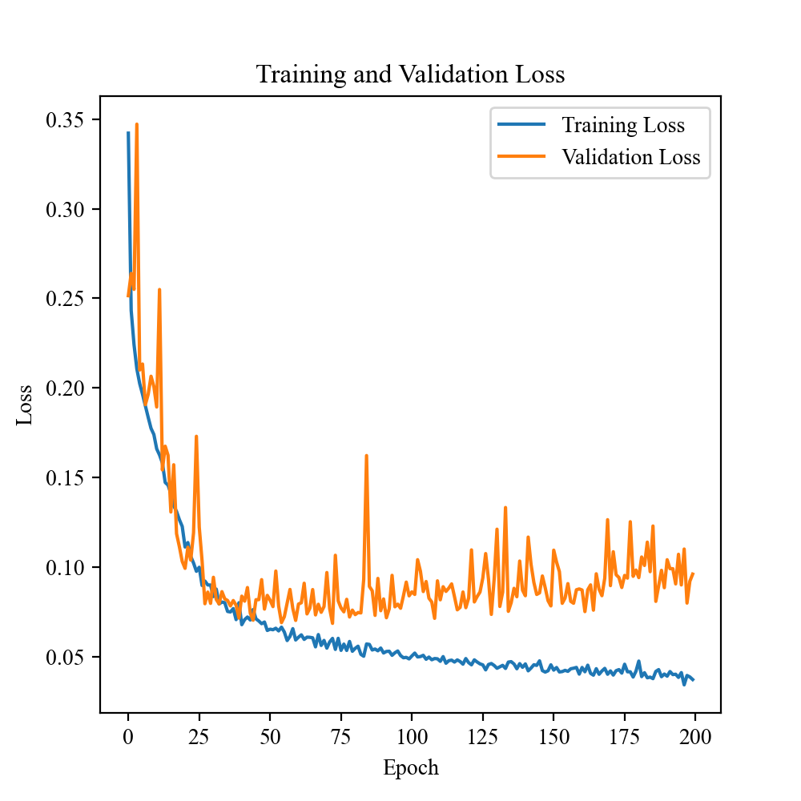
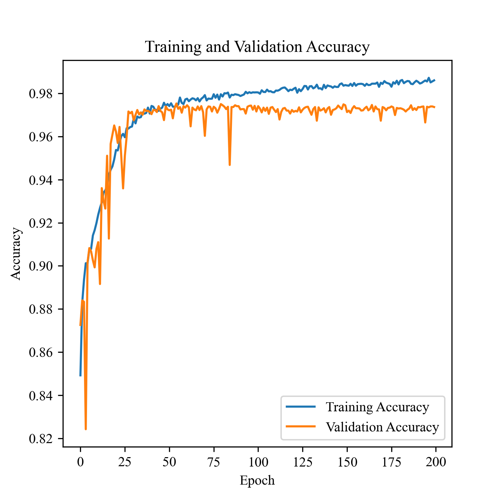

# Reproduction of DeepNetBim

## 数据预处理

我们的数据来源于免疫表位数据库（IEDB）中T细胞抗原表位预测的九肽数据，包括HLA与肽段结合能力数据`binding_origin.csv`和免疫原性数据`immunogenic_origin.csv`。在数据处理的过程中，我们去除了长度不为9的肽段，以便后续的训练和泛化。为了方便计算亲和力，我们用下列式子把IC50转换落为于区间 $[0,1]$ 的值：
$\text{transformed(IC50)}=1-\frac{1-log(\text{IC50})}{log(5000)}$.
接着我们调用了`igraph`包构建了两个无向网络图。图中节点为HLA的等位基因和肽段，边的权值为HLA-肽段的结合力和有无免疫原性。进而我们可以从四个维度来衡量节点的中心性，分别是：度（degree）、接近度（closeness）、中介（betweenness）、特征向量（eigenvector）。最后我们分别得到了HLA和肽段自身的中心性数据，输出文件`bind_all.csv`和`immuno_all.csv`。

`Net_Dict_all.py`调用刚刚生成的结果文件。`MHC_Net_Dict()`会从输入的数据中提取HLA蛋白质的网络特征，并将这些特征存储在一个字典中，其中字典的键是HLA蛋白质的标识`mhc`，而字典的值是一个包含HLA蛋白质的网络特征的子字典；同理，`Pep_Net_Dict()`从输入的数据中提取肽段的网络特征，并将特征存储在一个字典中，其中字典的键是肽段的标识`sequence`，而字典的值是一个包含肽段的网络特征的子字典。我们把处理后的字典以Numpy二进制文件保存。

`Median_network.py`计算两组数据中的HLA蛋白质网络特征的中位数，并将这些中位数值保存为Numpy的二进制文件。

`MyEcode.py`负责利用BLOSUM打分矩阵对输入的肽段进行重新编码，其中非氨基酸字符用Z来存储。

`Train.py`中的函数`save_npy()`负责以Numpy二进制文件的形式保存我们后续训练和测试需要用到的数据集，其中涉及到的函数有：

- `peptides()`：提取文件中的肽段，通过`MyEncode.py`中的函数对肽段进行BLOSUM编码，生成维度为 $(n,9,21)$ 的张量
- `network()`：提取文件中的8个中心性数据，生成维度为 $(n,8)$ 的张量
- `affinity()`：提取文件中的亲和力数据
- `cate()`：提取文件中的免疫原性信息，有免疫原性记为 $[1,0]$，无免疫原性记为 $[0,1]$，生成维度为 $(n,2)$ 的张量

## 深度学习框架

详细代码见`Train.py`

## 训练结果

我们将数据以7:3的比例随机划分为训练集和测试集。在训练过程中将训练日志保存在`src/log`文件夹下，接下来使用`plot.py`来绘制训练过程中的损失曲线和准确率曲线，以帮助分析和监控模型的训练进展和性能。对于结合力模型，我们绘制了训练MSE和验证MSE曲线

对于免疫原性模型，我们绘制了分类准确率曲线和损失曲线

最后，运用`test_model()`可以加载我们预先训练好的模型。可以看到，我们的模型在预测亲和力和免疫原性上都有不错的表现

| Affinity test MSE | Immunogenicity test accuracy |
| :---------------: | :--------------------------: |
|      0.13967      |           0.97368            |

